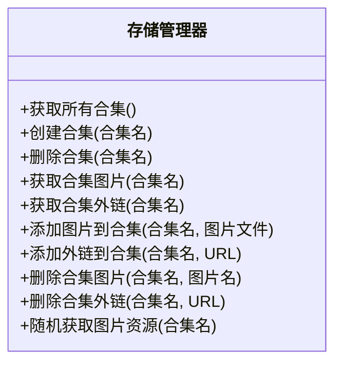
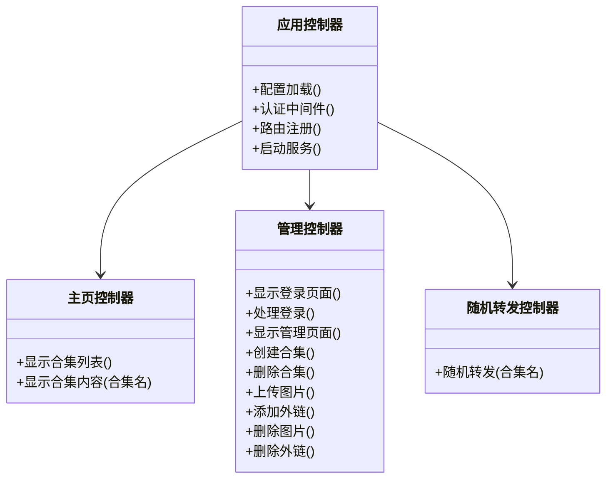

# 图床转发项目详细设计方案

## 一、技术选择

考虑到项目需求，我推荐使用**Flask**作为Web框架，理由如下：

1. **轻量级**：Flask核心简洁，非常适合这类中小型应用
2. **灵活性**：容易实现自定义URL路由（对随机转发功能很重要）
3. **简单直观**：开发和维护成本较低
4. **丰富的扩展**：可以按需添加功能（如Flask-Login用于管理认证）

其他技术组件：
- **前端**：HTML + CSS + JavaScript + Bootstrap（简洁美观的UI）
- **数据存储**：文件系统（按照你的需求）
- **容器化**：Docker（满足部署需求）

## 二、系统架构

```mermaid
graph TD
    A[用户/浏览器] --> B[Web服务 - 端口46000]
    B --> C[主页路由]
    B --> D[管理路由]
    B --> E[随机转发路由]
    
    D --> F[认证中间件]
    F --> G[合集管理]
    F --> H[图片管理]
    
    G --> I[文件系统存储]
    H --> I
    E --> I
    
    I --> J[/picture/合集1]
    I --> K[/picture/合集2]
    I --> L[/picture/合集n]
    
    J --> M[本地图片文件]
    J --> N[外链.txt文件]
```

## 三、核心功能模块设计

### 1. 数据存储模块



### 2. Web服务模块



## 四、详细功能实现计划

### 1. 项目初始化与基础框架搭建

1. 创建项目目录结构
2. 安装必要的依赖包
3. 创建基础Flask应用
4. 实现配置加载（包括.env文件读取）

### 2. 存储系统实现

1. 开发存储管理器类
2. 实现合集创建、读取、删除功能
3. 实现图片文件的存储和读取
4. 实现外链文件的创建和管理
5. 实现随机资源获取逻辑

### 3. 用户认证系统

1. 实现基于.env文件的简单认证系统
2. 创建登录页面和验证逻辑
3. 实现认证中间件保护管理路由

### 4. 主页功能

1. 设计合集列表页面布局
2. 实现合集内容展示功能
3. 创建图片预览功能

### 5. 管理后台功能

1. 设计管理界面布局（左侧合集列表，右侧操作区）
2. 实现合集管理功能（创建/删除）
3. 开发图片上传功能
4. 实现外链批量添加功能
5. 创建图片预览和管理界面

### 6. 随机转发功能

1. 实现随机选择算法
2. 创建本地图片直接返回的逻辑
3. 实现外链HTTP重定向功能

### 7. Docker部署

1. 创建Dockerfile
2. 配置Docker容器环境
3. 设置数据卷映射

## 五、项目目录结构

```
image-forward/
│
├── app/                    # 应用代码
│   ├── __init__.py         # 应用初始化
│   ├── routes/             # 路由模块
│   │   ├── __init__.py
│   │   ├── main.py         # 主页路由
│   │   ├── admin.py        # 管理路由
│   │   └── redirect.py     # 随机转发路由
│   ├── storage/            # 存储管理
│   │   ├── __init__.py
│   │   └── manager.py      # 存储管理器
│   ├── auth/               # 认证模块
│   │   ├── __init__.py
│   │   └── auth.py         # 认证逻辑
│   ├── static/             # 静态文件
│   │   ├── css/            # 样式文件
│   │   ├── js/             # JavaScript文件
│   │   └── img/            # 界面图片
│   └── templates/          # HTML模板
│       ├── index.html      # 主页
│       ├── login.html      # 登录页
│       ├── admin.html      # 管理页
│       └── collection.html # 合集查看页
│
├── picture/                # 图片存储目录
│
├── config.py               # 配置文件
├── run.py                  # 应用入口
├── requirements.txt        # 依赖列表
├── Dockerfile              # Docker配置
├── docker-compose.yml      # Docker Compose配置
└── .env                    # 环境变量配置
```

## 六、接口设计

### 1. 主页接口

- GET `/` - 显示所有合集列表
- GET `/view/<collection_name>` - 查看特定合集内容

### 2. 管理接口

- GET `/admin` - 管理界面（需认证）
- POST `/admin/login` - 登录处理
- POST `/admin/collection/create` - 创建新合集
- POST `/admin/collection/delete` - 删除合集
- POST `/admin/collection/<collection_name>/upload` - 上传图片到合集
- POST `/admin/collection/<collection_name>/add-links` - 添加外链到合集
- POST `/admin/collection/<collection_name>/delete-image` - 删除合集中的图片
- POST `/admin/collection/<collection_name>/delete-link` - 删除合集中的外链

### 3. 随机转发接口

- GET `/<collection_name>` - 从指定合集随机返回一个图片资源

## 七、实施时间线

1. **准备阶段**（1天）
   - 环境搭建
   - 依赖安装
   - 基础框架创建

2. **核心功能开发**（3-4天）
   - 存储系统实现
   - 认证系统开发
   - 主要路由功能实现

3. **界面开发**（2-3天）
   - 管理界面设计与实现
   - 主页设计与实现

4. **测试与优化**（1-2天）
   - 功能测试
   - 性能优化

5. **Docker部署**（1天）
   - Dockerfile创建
   - 容器化测试

## 八、关键技术细节

### 1. 随机转发功能实现

```python
def random_redirect(collection_name):
    # 获取合集所有资源（本地图片和外链）
    resources = storage_manager.get_all_resources(collection_name)
    if not resources:
        return "合集不存在或为空", 404
    
    # 随机选择一个资源
    resource = random.choice(resources)
    
    # 判断是本地图片还是外链
    if resource.startswith('http'):
        # 外链：通过HTTP重定向
        return redirect(resource)
    else:
        # 本地图片：直接返回文件
        return send_file(resource)
```

### 2. 管理认证功能

```python
def authenticate():
    # 从.env加载管理员密码
    admin_password = os.getenv('ADMIN_PASSWORD')
    
    # 验证提交的密码
    if request.form.get('password') == admin_password:
        session['authenticated'] = True
        return True
    return False

# 认证中间件
@app.before_request
def auth_middleware():
    if request.path.startswith('/admin') and not request.path.endswith('/login'):
        if not session.get('authenticated'):
            return redirect('/admin/login')
```

### 3. 外链存储实现

```python
def add_links_to_collection(collection_name, links):
    # 获取外链文件路径
    links_file = os.path.join(PICTURE_DIR, collection_name, f"{collection_name}.txt")
    
    # 确保目录存在
    os.makedirs(os.path.dirname(links_file), exist_ok=True)
    
    # 将新链接添加到文件
    with open(links_file, 'a') as f:
        for link in links:
            f.write(f"{link.strip()}\n")
```

## 九、Docker配置

```dockerfile
FROM python:3.9-slim

WORKDIR /app

COPY requirements.txt .
RUN pip install --no-cache-dir -r requirements.txt

COPY . .

# 创建picture目录
RUN mkdir -p /app/picture

# 设置环境变量
ENV FLASK_APP=run.py
ENV FLASK_ENV=production

# 暴露端口
EXPOSE 46000

# 启动命令
CMD ["python", "run.py"]